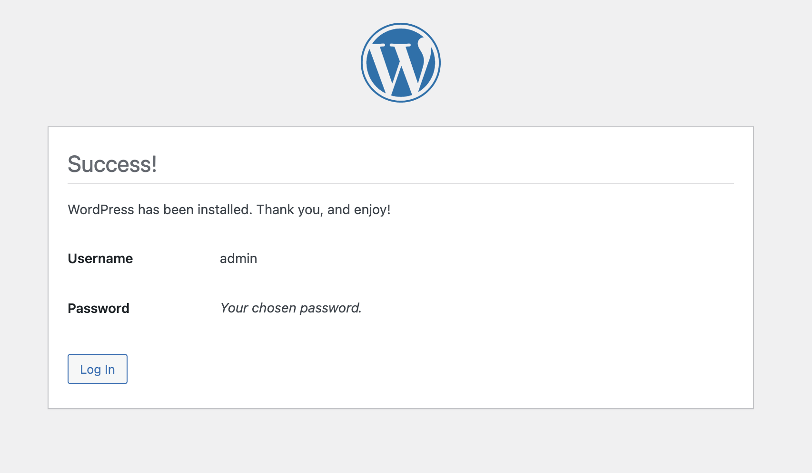
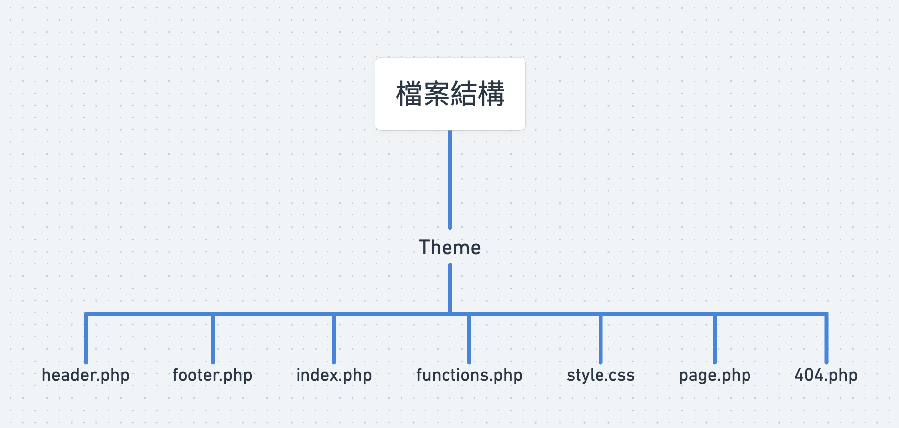

# WordPress Project Setup

此文檔是紀錄從使用 Docker 打包執行 WordPress 及 MySQL 環境，WordPress 後台頁面初始化安裝及 Custom Theme 開發前置作業及注意事項

## 大綱環節：
+ 以 [WordPress 官方](https://docs.docker.com/samples/wordpress/) 提供的 docker-compose.yml 執行環境安裝
+ WordPress 後台頁面初始化安裝
+ Theme 檔案結構及專案位置說明
+ Custom Theme 開發前置作業及注意事項
+ header, footer 檔案複用及分割說明

---
# docker 環境及 WordPress 後台頁面安裝

## docker-compose 創建
在專案內新增 `docker-compose.yml` 的檔案並貼上下方內容   
docker-compose 會在 docker container 內掛載 WorPress Project 及 MySQL
```dockerfile
      version: "3.9"
      services:
         db:
         image: mysql:5.7
      volumes:
         - db_data:/var/lib/mysql
      restart: always
      environment:
         MYSQL_ROOT_PASSWORD: somewordpress
         MYSQL_DATABASE: wordpress
         MYSQL_USER: wordpress
         MYSQL_PASSWORD: wordpress
    
      wordpress:
      depends_on:
         - db
      image: wordpress:latest
      volumes:
         - wordpress_data:/var/www/html
      ports:
         - "8000:80"
      restart: always
      environment:
         WORDPRESS_DB_HOST: db
         WORDPRESS_DB_USER: wordpress
         WORDPRESS_DB_PASSWORD: wordpress
         WORDPRESS_DB_NAME: wordpress
      volumes:
         db_data: {}
         wordpress_data: {}
   ```
開啟終端執行：
```shell
docker-compose up -d
```
成功後終端會出現顯示
```shell
Creating network "example_default" with the default driver
Creating volume "example_db_data" with default driver
Creating volume "example_wordpress_data" with default driver
Creating example_db_1 ... done
Creating example_wordpress_1 ... done
```
此時可以在終端執行 `docker ps` 查看 container 內是否成功運行   


## WordPress 安裝
確認過 docker container 正常運行後，可以點開網頁瀏覽器並訪問 `http://localhost:8000` 或 `http://ip-host:8000` 進入頁面   
看到初始頁面(如下方附圖)   

   

接著會看到帳號註冊的設定頁面(如下方附圖)   
+ 此處創建的帳號是該專案的管理員帳號，填完資料後點擊 install 繼續


安裝完成後會出現下圖，點擊 `Log in` 並輸入剛才註冊的使用者帳號及密碼後及可進入 WordPress 的後台頁面   
完成登入階段並看到後台頁面就代表 docker 環境及 WordPress 安裝完成   



---

# Custom Theme 開發
## 檔案結構
<!-- 命名注意事項 -->
Custom Theme 或從後台頁面安裝的 Theme 都會放在 `/var/www/html/wp-content/themes` 內   
+ 下圖中的檔案架構為一個 Custom Theme 基本檔案配置，檔案命名需對應附圖名稱，否則上傳 Theme 安裝時會出現錯誤   



## 開發時需注意的事項
在 WordPress 後台主題編輯欄的各個主題會有名稱和敘述，這些欄位是對應在檔案的 `style.css` 內，如果沒有附註，主題在載入時也會報錯
+  Global CSS 可以在同支檔案中寫入，也可另外創建 `CSS` 檔進行分割管理
### style.css 格式
```CSS
/*
Theme Name: your theme name
Theme URI:: theme url (options)
Author: developer
Description: project Description
Version: 1.0
*/
```
### page, homepage 開發
+ WordPress 允許 header, footer 的複用，但需對當頁的 HTML 進行切割，基準點以 `body` 的開閉標籤為分界，上下分別對應 header.php, footer.php 
 
+ 引入時只要 call WordPress API ，並檔案能存取到即可使用
```php
// header
<?php get_header(); ?>

// html content 

// footer
<?php get_footer(); ?>
```
