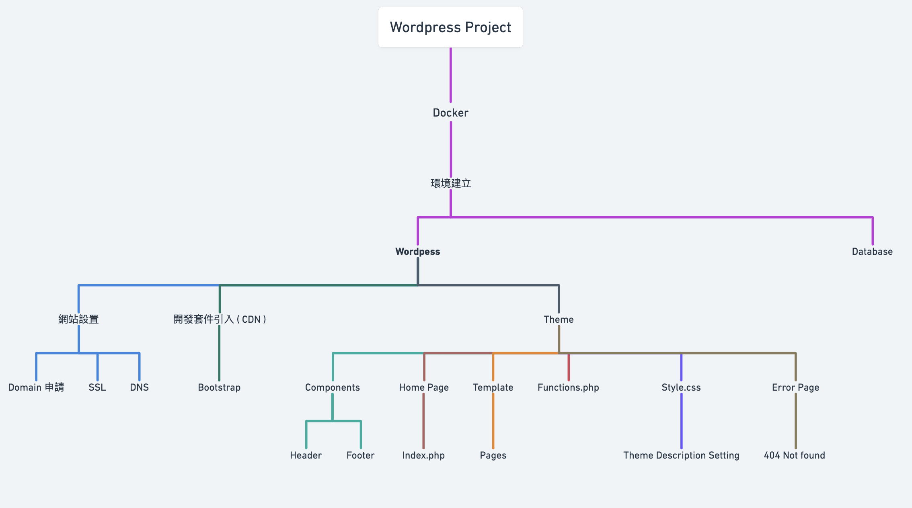
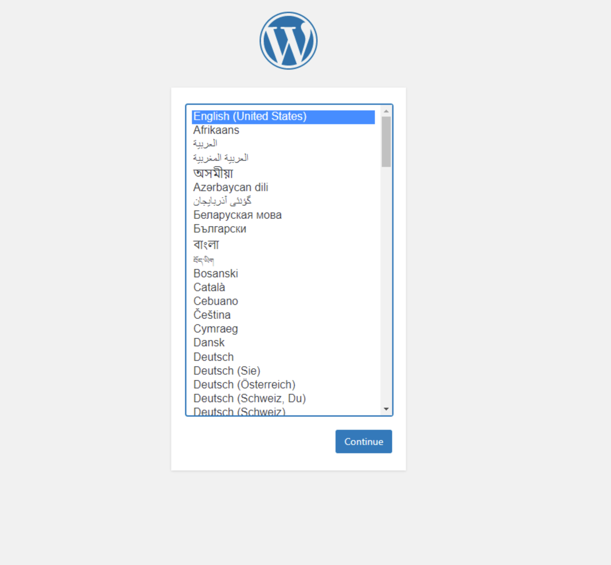
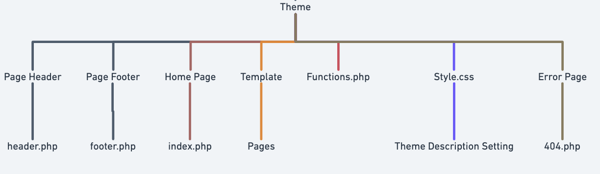
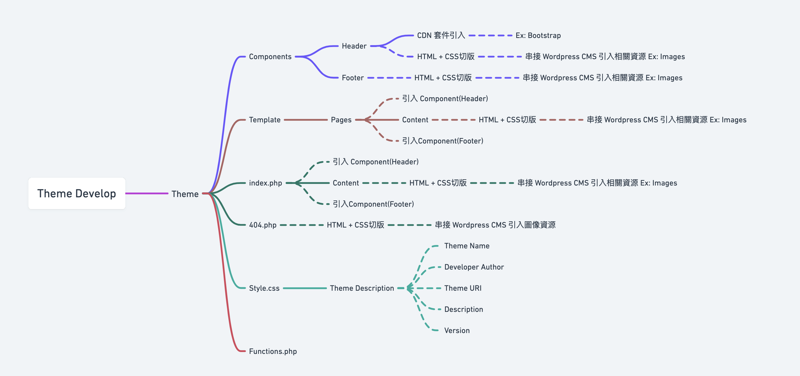

# Wordpress Project Setup
以 [My Doll](https://www.mydoll.com.tw/?lang=zh-TW) 首頁為範本所開發時間及過程

---

## 網域申請、設定
+ Domain
+ DNS
+ SSL

## Docker 環境建立
+ Docker Build ( 0.5H )
   + Wordpress
      + 後台頁面環境安裝 ( 0.5 H)
   + Database
## Theme 開發 
+ Header ( 2.5H )
   + 套件引入(CDN): Bootstrap 5 ( 0.5H )
+ Footer ( 2.5H ) 
+ Home Page ( 3H )
+ Template
   + Pages ( 1.5H )
---

### 專案架構圖


---

# Docker 
   ## Docker 環境安裝 ( 0.5H )
   ---
   Docker-compose.yaml
   ```dockerfile
      version: "3.9"
      services:
         db:
         image: mysql:5.7
      volumes:
         - db_data:/var/lib/mysql
      restart: always
      environment:
         MYSQL_ROOT_PASSWORD: somewordpress
         MYSQL_DATABASE: wordpress
         MYSQL_USER: wordpress
         MYSQL_PASSWORD: wordpress
    
      wordpress:
      depends_on:
         - db
      image: wordpress:latest
      volumes:
         - wordpress_data:/var/www/html
      ports:
         - "8000:80"
      restart: always
      environment:
         WORDPRESS_DB_HOST: db
         WORDPRESS_DB_USER: wordpress
         WORDPRESS_DB_PASSWORD: wordpress
         WORDPRESS_DB_NAME: wordpress
      volumes:
         db_data: {}
         wordpress_data: {}
   ```
   終端執行:
   ```zsh
      docker-compose up -d
   ```
   ## Wordpress 後台初始設定 (0.5H)
   瀏覽器進入網址 `http://localhost:8000/` 選擇語系後點擊 Continue 等待設定並進入後台系統頁面
   

---

# Theme 開發
檔案位置: `wordpress/wp-content/themes/'theme name'`
## 檔案結構

## Theme 開發流程概略


---

## Style.css 設置 ( 0.5H )
+ Theme Description: Theme 安裝時所需的描述檔
在 Style.css 內部寫入下列格式
```CSS
/*
Theme Name: your theme name
Theme URI:: theme url (options)
Author: developer
Description: project Description
Version: 1.0
*/
```
> Global CSS 可以在此寫入，也可另外創建 `CSS` 檔進行分割管理，只需記得引入 `header.php` 內

## Header, Footer 開發 
透過 wordpress hooks 可以複用 Header, Footer， 按照完整 HTML 檔案內容順序拆分如下
+ HTML
   + header.php 
      + `<html> 無關閉標籤`
      + `<head></head>`
      + `<body> 無關閉標籤`
   + footer.php
      + `<footer></footer>`
      + `</body>` 無起始標籤
      + `</html>` 無起始標籤

頁面或其他樣板開發需複用可以直接創建新檔案並撰寫 `<body></body>` 內部的版面內容，開頭及尾部引入header.php, footer.php 即可   
若是額外頁面，也可不引用直接以全新的 HTML 結構來開發
### Header Example: ( 3H )
```html
   <!DOCTYPE html>
   <html>
      <head>
         <!-- CDN Import -->
         <!-- CSS file route -->
         <!-- css file 引入時，需在檔案位置前墜帶入 <?php echo get_template_directory_uri(); ?> 以免 wordpress 識別不到路徑 -->
         <link rel="stylesheet" href="<?php echo get_template_directory_uri(); ?>/your file location/style.css">
         <title>Example</title>
      </head>
   
      <body>
         <header>
            <!-- header content -->
         </header>
```

### Footer Example: ( 2.5H )

```html
      <footer>
         <!-- Footer content -->
      </footer>
      </body>
   </html>
```
### Page-template Example: ( 1.5H )
```php
// header
<?php get_header(); ?>

// html content 

// footer
<?php get_footer(); ?>
```


# 附件
## [Flow chart](https://whimsical.com/wodrpess-develop-flow-LC7kEv7dY98nNKvphvZUP5)

## [Demo repo](https://github.com/pakerchang/wordpress-demo-mydoll)